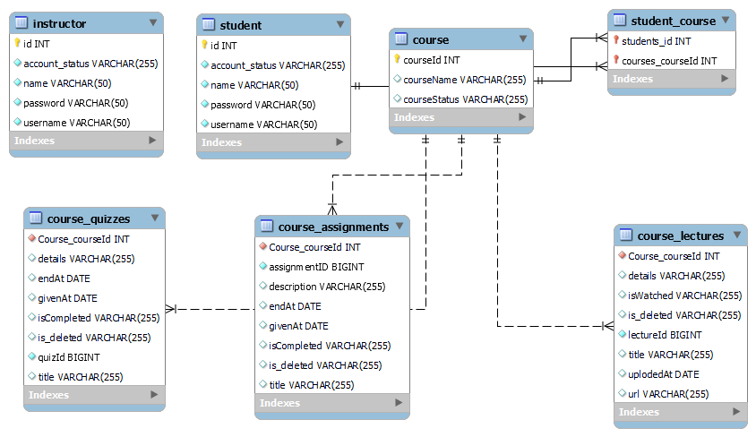

# eXcelerate: Accelerating Learning through Online Platforms
eXcelerate is a robust software solution that empowers remote education and training. This platform is specifically designed to equip educators with powerful tools for creating and delivering online courses, while providing students with an intuitive interface to access course materials, engage in assignments, and monitor their progress. With its advanced features like progress tracking, performance analytics, and effective communication tools, eXcelerate revolutionizes the teaching and learning experience, facilitating accelerated learning through online platforms.

## Roles:

- Admin role
- Insturctor role
- Student role 
### Insturctor can :
- See All courses
- See All students
- View course contents (Quiz,assignments & lectures)
- Update course contents (Quiz,assignments & lectures)
- Delete course contents (Quiz,assignments & lectures)
### Student can :
- See assigned courses
- view all assignments
- view all quizzes
- view all lectures
- Update assignment status
- Update quiz status
- Update lecture status
- See their stats 

## Installation steps

To install & run this application follow these few steps

- Open git bash & enter the below command

```bash
  git clone https://github.com/anuragjatofficial/major-flock-5344.git
```
- Import the project as maven project in any IDE (STS / Intelli J / Eclipse)
- Go to your MySQL command line client & enter the below command

```bash
  create database excelerate;
```
- Go to 
```bash
  major-flock-5344\eXcelerate\src\main\java\com\eXcelerate\App.java
```
- Run the `App.java file` as a Java application, and the application will start running in your console.


## Database Schema (ER Diagram)

  


## Tech Stacks 
- Java
- Maven
- MySQL

## System Requirements

- Java Development Kit (JDK)
- Maven
- MySQL Server
## Usage
Once the application is up and running, you can perform various tasks such as creating courses, adding assignments, updating quiz status, and more. Refer to the documentation or code comments for detailed instructions on using the system.

## Contributing

To contribute to eXcelerate: Accelerating Learning through Online Platforms, you can follow these steps:

1.  Clone the repository to your local machine.
2.  Make the desired changes and improvements in your local copy.
3.  Test your changes thoroughly to ensure they work as expected.
4.  Commit your changes with clear and descriptive commit messages.
5.  Push the changes to the main repository.
6.  Raise a Pull Request (PR) on the main repository, explaining the purpose and details of your changes.

## Author

Made with ❤️ by [Anurag Choudhary](https://github.com/anuragjatofficial)

For any inquiries or collaboration opportunities, feel free to reach out:

- Email: anurag.1101140@gmail.com
- LinkedIn: [Anurag Jat](https://www.linkedin.com/in/anuragjatofficial)
- GitHub: [anuragjatofficial](https://github.com/anuragjatofficial)